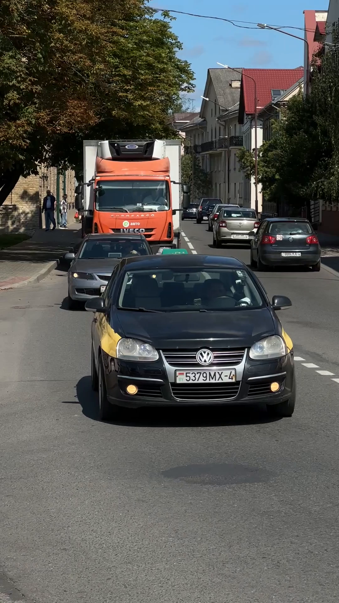
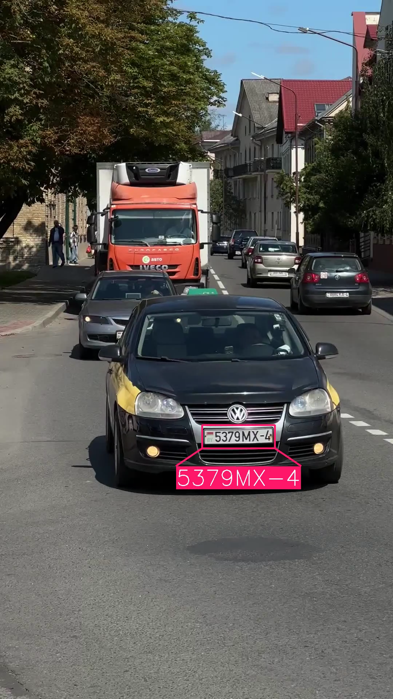
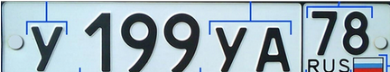

# Question #1

## Deep learning analytical thinking

### Problem description:

In 2024, several UK drivers were wrongly fined up to £105 for failing to pay the Dartford Crossing toll, despite never having used the crossing. The issue stemmed from ANPR cameras misreading vehicle licence plates, leading to incorrect penalty charge notices being issued. For instance, one driver received fines for vehicles with plates differing by a single character from her own, and another was fined for a vehicle of a similar make and color but with a slightly different registration number.

  
  

#### Interesting Links:
- [Drivers wrongly fined £105 after number plate cameras get details wrong](https://www.inyourarea.co.uk/news/drivers-wrongly-fined-105-after-number-plate-cameras-get-details-wrong)
- [Drivers hit with Dartford Crossing fines despite never using it amid number plate camera issues](https://www.gbnews.com/lifestyle/cars/drivers-fined-dartford-crossing-never-used)

### Assumptions:
- System was being built with a Deep Learning based model (not traditional computer vision methods) 

### Questions:

Please provide a document (and extra data if any) answering each question below; please note that no practical exercises are required here (just theoretical analysis) but feel free to add any.

1. What do you think it occurred during this model development (trainning & evaluation)?

Seeing this error when detecting the number plates of the UK cars, and with the information extracted from the links provided, there are several things that could be going wrong, the first thing I think is that when training the model they have used datasets that do not have enough examples of similar number plates, I also think that they may have overlooked when training it that the photos of the real number plates that it has may be blurred or partially obscured and that they may not have trained with enough variants of UK number plates in which the colour or number/letter arrangement changes.

It is also possible that the system did not have a post-OCR verification phase or that there was no cross validation system with database such as colour and make of vehicle vs. number plate verification. All this together can lead to the failure of ANPR in certain cases.

  
2. How would you fix this behavior? Please provide at least 2 options explaining their pros and drawbacks

As a first option, I would improve the dataset and retrain the OCR model by expanding the data with more challenging examples—such as plates with small differences, poor lighting conditions, dirt, tilted angles, or different character layouts. I believe this could effectively solve many of the problems the ANPR system was facing.

Some advantages of this option include increased robustness when identifying similar plates under adverse conditions. On the other hand, one major drawback is the amount of time the model would need to learn from all these new examples. Additionally, this alone wouldn’t solve the problem if the error is only occasional, so it would still require some kind of contextual validation.

If it’s not possible to obtain completely new data, data augmentation techniques could be used to generate semi-new data that can help make the model more robust.

As a second option, fine-tuning the model's hyperparameters could be performed to improve its performance. The exact method would depend on the specific model and the hyperparameters it uses (loss functions, learning rates, etc.), as well as the metrics the model is trying to optimize.

The main advantage of this option is that it pushes the model closer to its full potential—even with the same amount of data. The main disadvantage is the time required, since the model would need to be retrained multiple times to achieve the desired result.

Ultimately, if the necessary resources are available, both options could be combined to minimize the probability of error.

   
3. What do you think it will occur when running this AI in a different country with different plates formats? How would you ensure system accuracy?

When running ANPR with an OCR system in other countries, multiple errors can occur due to the clear differences in license plates between countries—such as color, alphabet, and character arrangement. Some plates also include extra characters like dashes instead of spaces, which can seriously confuse the model during recognition.

  
  

Here’s an example: a Russian license plate compared to a UK one shows these differences very clearly.

To prevent this from happening, one solution would be to train a version of the OCR model specifically adapted to each country, using local data and plate formats. The advantage of this approach is that it would be very accurate and make very few mistakes, since it can adapt to the specific details of each country. However, the downside is that it would take a lot of time and require country-specific datasets, which would be expensive and slow to gather.
A more viable alternative would be to build a multi-format model, where the system first detects which country the license plate belongs to, and then applies the specialized OCR model for that format. This is much more scalable and flexible, as it allows a single system to work across various scenarios. The downside is the technical complexity of implementing this multi-format pipeline, and the added risk of misidentifying the country of the license plate.

4. Do you know any OCR (Optical Character Recognition) algorithms (Deep learning based) that could be used here?

In my degree program, we haven’t covered much deep learning theory, but on my own—and as a result of a project I worked on during the last semester—I’ve learned about the CRNN model. I believe this model could work quite well in this context, as it can recognize text without needing to segment each character individually. It also performs well with distorted, tilted, or noisy text, which is common in license plate images.

Additionally, in my free time, I’ve read some papers on optical character recognition, and I’ve seen that Sequence-to-Sequence models often deliver good results. I don’t fully understand how these models work yet, but I’m very interested in learning more and continuing to build my knowledge in this area.

5. Explain a Computer Vision / Artificial Intelligence project in which you have participated (goals, your role, difficulties you found, how they were solved, ...)

The project I worked on was titled: Penetration Testing in Medical IoT Devices for Cybersecurity Resilience Act Compliance. At first glance, this may not seem directly related to deep learning, but in reality, deep learning was essential and played a fundamental role in the project.

Although the initial focus was on manual security testing, our team proposed a more advanced approach: to apply deep learning models to automatically detect cyberattacks based on network traffic analysis.

After capturing network packets and converting them into .csv format with the most relevant variables—such as inter-arrival time, IP addresses, ports, protocols, etc.—we followed a supervised learning approach, where the model was trained to classify traffic as either benign or malicious.

We first used a Random Forest, which performed very well with the tabular data extracted from real network traffic. It handled features like IPs, ports, packet counts, protocols, and flags. It was especially useful due to its interpretability and robustness to noise or nonlinear correlations. It clearly identified patterns typical of DoS (Denial of Service) attacks, such as mass packet sending in a short period or repeated connection attempts to the same target.

We later applied a Multilayer Perceptron (MLP) model, a pure deep learning approach, which also showed good results. However, it required more careful data normalization and hyperparameter tuning.

To generate the training data, we carried out real test scenarios between two Kali Linux virtual machines connected through a virtual internal network. I personally executed simulated DoS attacks using tools like hping3 and slowloris, and we captured the traffic using Wireshark, exporting it to .csv for analysis. The records were labeled as benign or malicious and used to train the models.

I was in charge of conducting the attacks, and together with a teammate, we trained the models. The final system achieved over 90% accuracy in attack classification and proved to be applicable in real-world environments involving medical IoT devices. This AI-based approach complements manual penetration testing, offering a proactive and automated solution for protecting critical healthcare infrastructure.

