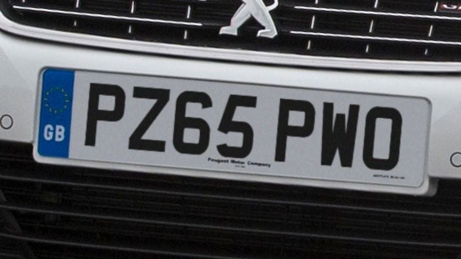
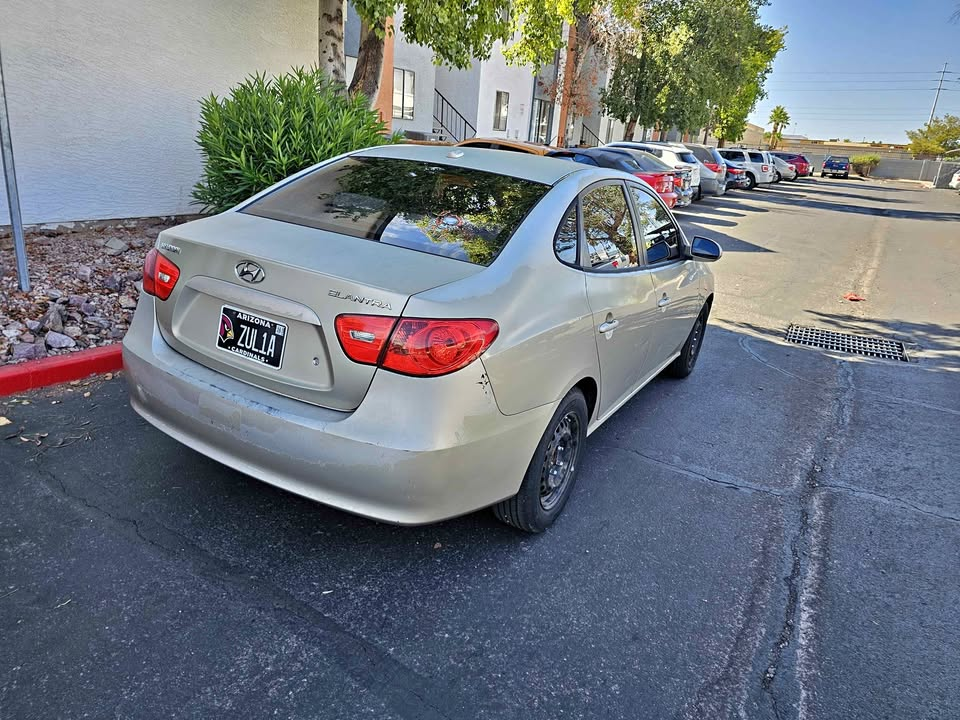

### Questions:

1. What do you think it occurred during this model development (trainning & evaluation)? 

Creo que lo que ocurrió durante el entrenamiento y la evaluación de este modelo, es que pudo haberse utilizado objetos de pruebas de baja calidad, provocando así que acabe eligiendo vehículos que tenían parecidos a los objetivos buscados. Es decir, el modelo buscaba similitudes pero no buscaba exactitud, llevando esto a problemas de mayor grado.

2. How would you fix this behavior? Please provide at least 2 options explaining their pros and drawbacks

Para arreglar este comportamiento, primero, utilizaría objetos de prueba de mejor calidad, en donde las matrículas y los coches puedan verse a buena calidad y el modelo pueda observar más detalles. Segundo, añadiría un sistema de recompensa donde si encuentra al mismo coche, con la misma matrícula, la misma marca, es decir, idéntico, conseguiría una gran recompensa, pero si encuentra pocas similitudes, por ejemplo misma marca y color pero distinta matrícula, le pondría una recompensa mucho menor para que evite buscar similitudes vagas.

3. What do you think it will occur when running this AI in a different country with different plates formats? How would you ensure system accuracy?

Lo que ocurriría con esta IA al ser utilizada en otro país es que se encontrara con distintos tipos de matrícula, ya que las matrículas son identificadores únicos de cada sitio como los números telefónicos. Por ejemplo:

  
  

Para asegurar precisión, hay que entrenar el modelo según el país donde se encuentre, aunque esto podría llevar tiempo y bajaría su utilidad siendo más fácil el uso humano, ya que las matrículas pueden diferenciar mucho y una IA sin una actualización que pueda reconocer vehículos y placas como lo hace un cerebro humano solo generaría problemas y confusión. Es decir, una manera más correcta sería conseguir modelar una IA como un humano en el tema identificación.

4. Do you know any OCR (Optical Character Recognition) algorithms (Deep learning based) that could be used here?

No tengo conocimientos de algoritmos OCR pero, después de una ligera búsqueda sobre estos algoritmos, podría decir que el Pattern matching sería un buen algoritmo para empezar respecto a este problema, teniendo en cuenta que desconozco este tipo de algoritmos. El Pattern matching busca aislar caracteres llamados "glyph" del resto de la imagen y compararlos con otros "glyphs" guardados como templates en un pixel-by-pixel basis. Esto puede ser útil para tener la información directamente de una matrícula ya que sería más certero la información de la matrícula. 

5. Explain a Computer Vision / Artificial Intelligence project in which you have participated (goals, your role, difficulties you found, how they were solved, ...)

Un proyecto de inteligencia artificial que haya participado y que destacaría, sería el primer proyecto llevado a cabo donde hacíamos una asignación de paquetes a ofertas que tenían un máximo cupo de kg. En este proyecto usamos algoritmos de búsqueda local tales como Hill Climbing y Simulated Annealing. En este proyecto no habían roles tan fijados, pero en mi caso, yo podía guíar las ideas de mis compañeros, explicarlas y/o hacer preguntas de manera más correctas al profesor. Una de las dificultades afrontadas fue el cómo almacenaríamos los datos, lo que llevó a la incógnita de qué sería lo más eficiente, yo propuse el uso de vectores debido a que en una tarea que hicimos en clase tenía un parecido a este proyecto y fue la opción más eficiente que recomendó el profe para esa tarea y al final la idea de los vectores fue correcta y su manera de implementación. Otro problema encontrado fue designar los operadores de los algoritmos Hill Climbing y Simulated Annealing, al principio se vio como algo complicado, que al final resultó ser algo tan sencillo como "mover paquete", conseguimos llegar a esa conclusión hablando en grupo y decidiendo qué sería lo mejor.