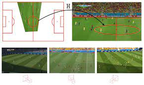

# Computer Vision / ML Engineer Test

## What is this test about?
If you are reading this document, then you are in the process of becoming a new member of our team. Like any other company, at Fluendo we are looking for the best talent to join our team, but it’s always hard to do so just by reading a CV or in a 1-hour Q&A interview.

The goal of this test is to understand how you would fit in our Research, Development and Innovation as a Computer Vision / ML engineer by simulating the process of planning and executing a challenge similar to the ones you would face working at Fluendo.
Your role will consist in leading computer vision and ML projects that will be used in production by our products, one of them being LongoMatch, a video analysis software for sports.

The goal of this test is to check your skills in the following topics:

 * You have a good knowledge of state-of-the art algorithms and techniques to approach different Computer Vision / ML projects
 * You can plan a Computer Vision / ML project from start to finish including data sets annotations, training, model optimization, inference, model deployments
 * You have a good knowledge of at least a popular ML framework
 * You can create reproducible work and can propose
 * You know how to deploy a project in production

## The rules

LongoMatch is a product of Fluendo, a video analysis software for sports. We are planning to launch a big new feature next year, a new video telestration tool that is capable of drawing animations on top of the video by following players. One the requirements for this new product is the ability to overlay distances between players. We have already finished the first part of project consisting of a new API that is capable of tracking players and identifying them across video sequences.

We now need to tackle this new feature as a new project in the R+D+i department. The idea is to develop a new API that is capable of doing the camera calibration and provide an estimation of the homography matrix.

We would like you to present how you would approach this problem from start to end. We are not interested in knowing the complete details of the implementation, instead we are more looking in the process you will be follow and how you will ensure that you achieve a success in a maintainable way.

As a guide, we would like to know
  * What is the state-of-art regarding this specific problem
  * What method will you use to attack the problem
  * What data set will you use, or how you would annotate a new data set
  * How will you train the model
  * How will you evaluate the performance of your model
  * How will you improve your model
  * How will you ship the new solution in production

 Good luck!

