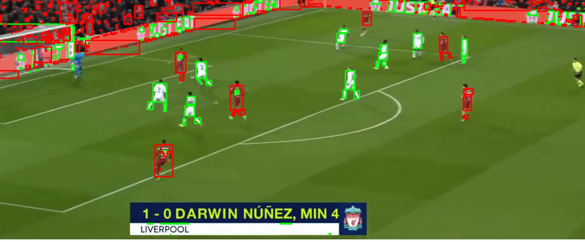

# Q2

## 1. ¿Qué algoritmos utilizarías para lograr esto? Por favor, proporciona al menos 2 propuestas.

Como el objetivo en estas preguntas no es detectar y clasificar en tiempo real, podríamos utilizar:

- Podemos utilizar una CNN más compleja que YOLO como lo es MASK R-CNN, esta es más lenta que YOLO pero más robusta.

Pero si no tenemos tantos datos para entrenar el modelo, podríamos utilizará métodos más tradicionales, como:

- Una substracción del background, usando una mezcla gaussiana para diferenciar entre background y foreground y así identificar jugadores en movimiento. Después de esto, podríamos hacer un filtro de colores de las camisetas.

## 2. ¿Con qué posibles cuellos de botella puede encontrarse este problema? (por ejemplo, una cámara no estática). Simplemente enumérelos (si los hay).

Las dos propuestas tienen cuello de botella similar:

- La iluminación: si no hay suficiente luz, las propuestas fallarán al detectar y clasificar, ya que esta afecta al color y la visibilidad de los jugadores

- La cámara y la calidad de video: La posición de la cámara, el ruido, la baja calidad de video o si la imagen es muy borrosa afectarían mucho a cualquiera de las dos propuestas

- Las equipaciones de los equipos: si son muy parecidas puede que la clasificación se haga mal o si son muy parecidas al background, estas fallarían

- Oclusión entre jugadores: en la mayoría de deportes los jugadores van corriendo de un lado a otro, esto puede generar momentos donde unos tapan a otros desde la visión de una cámara, y este momento justo puede dar problemas para las propuestas (esto se podría arreglar con la posición de la cámara).

Aparte, personalmente creo que los deportes de agua darían bastantes problemas debido a distorsiones que hace el agua y la oclusión de los jugadores en el agua.

## 3. ¿Se podrían aplicar tus propuestas a otros deportes de equipo? (por ejemplo, hockey, rugby, ...) ¿Cuáles serían los escenarios más desfavorables?

Sí, pero con algunas limitaciones:

- En la primera propuesta se ha de tener en cuenta que por cada deporte se tendría qué pre-entrenar el modelo con datos del deporte. Y aun así habría deportes donde funcionarían mal, el peor caso sería para un deporte donde los jugadores están muy juntos, como en el rugby, ya que podría haber mucha oclusión y superposición entre los jugadores que dificultaría la detección y clasificación.

- Y en la segunda, hay que adaptar el filtrado a los colores a las equipaciones del deporte y del equipo. Y aun así habría deportes donde funcionarían mal, el peor caso sería para un deporte donde los jugadores están estáticos durante largos periodos de tiempo, como el béisbol. Otro peor sería para deportes donde no hay mucho contraste entre los jugadores y las equipaciones. 

## 4. Extra: proporciona un código de muestra con una propuesta en ejecución.

Por tiempo, complejidad y por falta de dataset he optado por hacer la propuesta con métodos tradicionales. He hecho una substracción del background y filtro por colores, también quise hacer un filtrado por tamaño, pero me di cuenta de que el video que utilice no era el más adecuado para eso debido a los diferentes cambios de cámara. También intenté hacer con HOG's, pero me iba muy lento, así que decidí no utilizarlos.

He de decir que me hubiera gustado hacerlo con un CNN bien entrenado ya que haría un mejor trabajo, pero que no estoy para nada descontento con el trabajo que he conseguido con métodos tradicionales.

