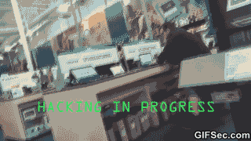

# RDI Tech Assessment: Computer Vision Engineer

## What is this test about?

If you are reading this document, then you are in the process of becoming a new member of our team. Like any other company, at Fluendo we are looking for the best talent to join our team, but it’s always hard to do so just by reading a CV or in a 1-hour Q&A interview.

    

The goal of this test is to understand how you would fit in our Research, Development and Innovation team as a Computer Vision engineer through a set of **fast** tasks (mini-tests) which will introduce you to our team's scope and will let us know more about you.

## How to proceed?

In this repository you will find a set of sub-folders named "Q_x" inside each one you will find all required instructions, data & objectives,  so don't worry about creating a testing environment (we do it for you!).

Each mini-test has been designed to evaluate some specific skills so you may find tests in which you must code, others in which you should reason an idea, answer technical questions, ... So please take a look at each task objectives before starting this test.

### Instructions:

1. Fork Fluendo's Github (GH) into your local GH account
2. Take your time to fill the test
3. (If any) extra document is created/needed, feel free to add them to your fork
4. Once test is finished, launch PR to Fluendo's repo and notify us via email
5. After internal review, you will be prompted to perform a technical review with some RDI's team members

## What do we evaluate?

In Fluendo we look for the best members to join our team so we do not only focus on technical abilities but also on your analytical thinking, personality, team-work predisposal, ... See below a list of our evaluation guidelines:

1. Technical skills
2. Problem solving capability
3. Innovation ability
4. Communication skills
5. Timing and organization methodology
6. Coding style

## Rules:

- All data (documents, scripts, images, ...) is property of Fluendo so you are not allowed to distribute them
- None mini-test has time limit; however you must satisfy global tech assessment previously agreed timing
- This assessment can be answered in Spanish or English as you feel more comfortable

Good luck!

    

